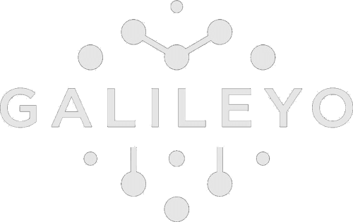

# Galileyo Laravel Application

<p align="center">

</p>

<p align="center">
<a href="https://github.com/KalimeroMK/GalileyoLaravel/actions"></a>
<a href="https://packagist.org/packages/laravel/framework"></a>
<a href="https://packagist.org/packages/laravel/framework"></a>
<a href="https://opensource.org/licenses/MIT"></a>
</p>

## About Galileyo

Galileyo is a comprehensive Laravel application built with modern architecture patterns, featuring a robust API backend with complete Swagger documentation, Vue.js frontend, and Docker containerization for seamless development and deployment.

## 🏗️ Architecture & Patterns

The application follows **Domain-Driven Design (DDD)** principles with clear separation of concerns:

-   **Domain Layer**: Contains business logic, actions, DTOs, and services
-   **Application Layer**: HTTP controllers, requests, and resources
-   **Infrastructure Layer**: Database, external services, and configurations

### Architecture Transformation

**Old Architecture (Yii2):**

-   Mixed business logic in controllers
-   Direct database queries in views
-   Inconsistent error handling
-   Views mixed with data fetching logic

**New Architecture (Laravel 12 + DDD):**

-   **Domain-Driven Design** - Clear separation of concerns
-   **Action Classes** - All business logic encapsulated
-   **DTO Pattern** - Data Transfer Objects for input/output
-   **Request Classes** - Centralized validation
-   **Resource Classes** - Consistent API responses
-   **Minimal Controllers** - Controllers are thin, only handle HTTP

### Key Patterns

1. **Action Pattern** - Each business operation has its own Action class. Actions are injected into controllers via constructor. Actions return data, never responses.

2. **DTO Pattern** - DTOs are used ONLY for create/update operations. For read operations, direct parameters are used in Action execute() method.

3. **Service Pattern** - Domain Services for complex business logic. Services are injected via interfaces. All Services are registered in `AppServiceProvider`.

4. **Request/Resource Pattern** - Request classes for input validation. Resource classes for API response formatting.

## 🚀 Quick Start

### Prerequisites

-   Docker and Docker Compose
-   Git
-   Minimum 4GB RAM

### Installation & Setup

1. **Clone the repository**

```bash
git clone https://github.com/KalimeroMK/GalileyoLaravel.git
cd GalileyoLaravel
```

2. **Start Docker environment**

```bash
./docker-start.sh
```

This script automatically:

-   Builds the Docker image
-   Starts all services (app, nginx, mysql, redis, selenium)
-   Installs PHP and Node.js dependencies
-   Builds Vue.js frontend
-   Generates application key
-   Runs migrations and seeders

3. **Access the application**

-   **Frontend**: http://localhost
-   **Admin Panel**: http://localhost/admin/login
-   **API Documentation**: http://localhost/api/documentation

### Docker Services & Ports

| Service         | Container           | Port            | Description      |
| --------------- | ------------------- | --------------- | ---------------- |
| **Nginx**       | `galileyo_nginx`    | 80              | Web server       |
| **Laravel App** | `galileyo_app`      | 9000 (internal) | PHP-FPM          |
| **MySQL**       | `galileyo_mysql`    | 3307            | Database         |
| **Redis**       | `galileyo_redis`    | 6380            | Cache & sessions |
| **Selenium**    | `galileyo_selenium` | 4444            | Dusk tests       |

### Docker Commands

```bash
# Start all services
./docker-start.sh

# Stop all services
docker compose down

# View logs
docker compose logs -f

# Access application container
docker exec -it galileyo_app bash

# Run Artisan commands
docker exec galileyo-app php artisan [command]
```

### Test User Credentials

| Role           | Email                   | Password | Description         |
| -------------- | ----------------------- | -------- | ------------------- |
| **Admin**      | admin@galileyo.com      | password | Full system access  |
| **User**       | user@galileyo.com       | password | Regular user access |
| **Influencer** | influencer@galileyo.com | password | Influencer account  |

## 📦 Complete Module List

### API Modules (Refactored to DDD)

All API modules have been refactored from Yii2 to Laravel 12 with full DDD architecture:

1. **Authentication & Authorization** ✅

    - AuthController - Login, logout, token management
    - UsersController - User management API

2. **Payment & Finance** ✅

    - PaymentController - Credit card management
    - PaymentHistoryController - Payment transaction history
    - OrderController - Order processing
    - InvoiceController - Invoice management

3. **News & Content** ✅

    - NewsController - News feed, posts management
    - CommentController - Comments system
    - BookmarkController - Bookmark functionality

4. **Chat & Communication** ✅

    - ChatController - Live chat system
    - ContactController - Contact form management

5. **Subscription Management** ✅

    - SubscriptionController - Subscription management
    - PrivateFeedController - Private feed subscriptions
    - PublicFeedController - Public feed subscriptions

6. **Device Management** ✅

    - DeviceController - Device CRUD operations
    - ProductController - Product and alert map management

7. **User Management** ✅

    - UsersController - User listing, details, updates
    - InfluencerController - Influencer management
    - CustomerController - Customer membership management

8. **Email & SMS** ✅

    - EmailPoolController - Email pool management
    - EmailTemplateController - Email template management
    - PhoneController - Phone number management

9. **Analytics & Reports** ✅

    - ReportController - Analytics and reporting
    - SearchController - Search functionality

10. **Settings & Configuration** ✅

    - SettingsController - System settings
    - MaintenanceController - Maintenance mode
    - StaffController - Staff management

11. **Notifications** ✅

    - PushController - Web push notifications

12. **Bundles & Contracts** ✅

    - BundleController - Bundle management
    - ContractLineController - Contract line management

13. **Forms** ✅
    - AllSendFormController - AllSend form handling

### Web Modules (Admin Panel)

Web modules for admin panel management:

1. **User Management**

    - UserController - User administration
    - StaffController - Staff management
    - InfluencerAssistantController - Influencer assistants
    - FollowerController - Follower management
    - FollowerListController - Follower lists

2. **Content Management**

    - NewsController - News administration
    - SmsPoolController - SMS pool management
    - SmsPoolArchiveController - SMS archive
    - PodcastController - Podcast management
    - PageController - Page management

3. **Payment & Finance**

    - PaymentController - Payment administration
    - CreditCardController - Credit card management
    - InvoiceController - Invoice administration
    - OrderController - Order management
    - MoneyTransactionController - Money transactions
    - UserPlanController - User plan management
    - ServiceController - Service management
    - ProviderController - Provider management
    - ContractLineController - Contract lines
    - PromocodeController - Promocode management

4. **Device & Product Management**

    - DeviceController - Device administration
    - ProductController - Product management

5. **Communication**

    - ContactController - Contact form administration
    - ChatController (Admin) - Admin chat interface
    - EmailPoolController - Email pool administration
    - EmailPoolArchiveController - Email archive
    - EmailTemplateController - Email templates
    - PhoneNumberController - Phone number management

6. **Subscription Management**

    - SubscriptionController - Subscription administration
    - SubscriptionCategoryController - Subscription categories
    - BundleController - Bundle administration

7. **Settings & Configuration**

    - SettingsController - System settings
    - MaintenanceController - Maintenance mode
    - ReportController - Reports administration

8. **Analytics & Logs**

    - ApiLogController - API logs
    - AdminMessageLogController - Admin message logs
    - ActiveRecordLogController - ActiveRecord logs
    - LogsController - General logs

9. **External Integrations**

    - IEXController - IEX webhooks
    - AppleController - Apple notifications
    - TwilioController - Twilio incoming messages
    - HelpController - Help system

10. **Other Modules**
    - AuthController - Web authentication
    - RegisterController - User registration
    - SiteController - Site management
    - InfoStateController - Info state management
    - EmergencyTipsRequestController - Emergency tips
    - DemoController - Demo functionality

## 🔄 Refactoring Summary

### Migration from Yii2 to Laravel 12

All modules have been created following these principles:

**Before (Yii2):**

-   Direct model queries in controllers
-   Business logic mixed with HTTP handling
-   Inconsistent error handling
-   No separation of concerns

**After (Laravel 12 + DDD):**

-   All business logic moved to Domain Actions
-   Controllers are minimal - single-line calls to Actions
-   No business logic in controllers
-   No try-catch blocks in Actions
-   DTOs for create/update operations
-   Request classes for validation
-   Resource classes for API responses
-   Proper service layer with interfaces
-   All services registered in AppServiceProvider

### Refactored Components

**Domain Layer:**

-   255 Action classes (business logic)
-   113 DTO classes (data transfer objects)
-   60 Service classes (domain services)
-   All services implement interfaces

**Application Layer:**

-   30 API Controllers (all refactored)
-   49 Web Controllers (admin panel)
-   134 Request classes (validation)
-   36 Resource classes (API responses)

**Infrastructure:**

-   118 Eloquent Models
-   170 Database Migrations
-   110 Model Factories
-   Proper relationships and eager loading

## 📚 API Documentation

### Swagger UI Access

**URL**: http://localhost/api/documentation

The application features **complete Swagger documentation** for all API controllers with:

-   Real authentication examples
-   Request/response schemas
-   Error handling examples
-   Interactive testing interface

## 🎨 Frontend Technology

-   **Framework**: Vue.js 3 with Composition API
-   **Styling**: Tailwind CSS 4
-   **Build Tool**: Vite
-   **Backend Views**: Laravel Blade with Bootstrap 5

### Frontend Development

```bash
# Development mode with hot reload
docker exec galileyo-app npm run dev

# Production build
docker exec galileyo-app npm run build
```

## 🗄️ Database

-   **Engine**: MySQL 8.0 (MariaDB)
-   **Database**: `galileyo`
-   **Cache**: Redis

### Database Commands

```bash
# Run migrations
docker exec galileyo-app php artisan migrate

# Fresh migration with seeding
docker exec galileyo-app php artisan migrate:fresh --seed
```

## 🧪 Testing

-   **Framework**: PHPUnit 12
-   **Test Status**: 177 tests (91.7%)
-   **Coverage**: Unit and Feature tests

### Running Tests

```bash
# Run all tests
docker exec galileyo-app php artisan test

# Run specific test file
docker exec galileyo-app php artisan test tests/Feature/AuthTest.php
```

## 🔧 Development Tools

### Code Quality

-   **Linting**: Laravel Pint (PSR-12)
-   **Static Analysis**: PHPStan
-   **Code Formatting**: Automatic formatting on save

### Useful Commands

```bash
# Format code
docker exec galileyo-app vendor/bin/pint

# Clear caches
docker exec galileyo-app php artisan optimize:clear

# Generate Swagger docs
docker exec galileyo-app php artisan l5-swagger:generate
```

## 📁 Project Structure

```
GalileyoLaravel/
├── app/
│   ├── Domain/              # DDD Domain layer
│   │   ├── Actions/         # 255 Action classes
│   │   ├── DTOs/            # 113 DTO classes
│   │   ├── Services/        # 60 Service classes
│   │   └── Exceptions/      # Domain exceptions
│   ├── Http/                # HTTP layer
│   │   ├── Controllers/
│   │   │   ├── Api/         # 30 API controllers
│   │   │   └── Web/         # 49 Web controllers
│   │   ├── Requests/        # 134 Request classes
│   │   └── Resources/        # 36 Resource classes
│   ├── Models/              # 118 Eloquent models
│   └── Providers/
│       └── AppServiceProvider.php
├── database/
│   ├── migrations/          # 170 migrations
│   ├── factories/           # 110 factories
│   └── seeders/
├── resources/
│   ├── js/                  # Vue.js components
│   ├── css/
│   └── views/               # 194 Blade templates
├── routes/
│   ├── api.php
│   └── web.php
└── tests/
```

## 🌐 Environment Configuration

### Key Environment Variables

```env
APP_NAME=Galileyo
APP_URL=http://localhost
DB_CONNECTION=mysql
DB_HOST=mysql
DB_PORT=3306
DB_DATABASE=galileyo
REDIS_HOST=redis
REDIS_PORT=6379
```

## 📈 Performance & Optimization

-   **Redis**: Session storage and caching
-   **Laravel Cache**: Application-level caching
-   **Database**: Query optimization with indexes
-   **Eager Loading**: Proper relationship loading

## 🤝 Contributing

1. Fork the repository
2. Create a feature branch (`git checkout -b feature/amazing-feature`)
3. Commit your changes (`git commit -m 'Add amazing feature'`)
4. Push to the branch (`git push origin feature/amazing-feature`)
5. Open a Pull Request

### Development Guidelines

-   Follow PSR-12 coding standards
-   Write tests for new features
-   Use DDD architecture patterns
-   Keep controllers minimal
-   Put business logic in Actions
-   Update documentation as needed

## 📄 License

This project is licensed under the MIT License.

## 🆘 Support

For support and questions:

-   **Documentation**: Check Swagger UI at http://localhost/api/documentation
-   **Issues**: Create an issue on GitHub
-   **Email**: Contact the development team

---

**Built with ❤️ using Laravel 12, Vue.js 3, and Docker**
